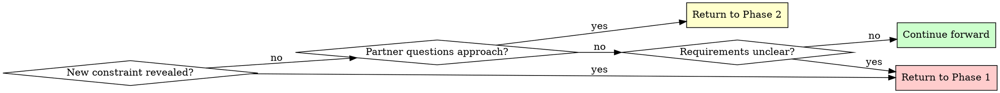

# Brainstorming Ideas Into Designs

## Overview

Transform rough ideas into fully-formed designs through structured questioning and alternative exploration.

**Core principle:** Ask questions to understand, explore alternatives, present design incrementally for validation.

**Announce at start:** "I'm using the brainstorming skill to refine your idea into a design."

## Quick Reference

| Phase | Key Activities | Tool Usage | Output |
|-------|---------------|------------|--------|
| **1. Understanding** | Ask questions (one at a time) | AskUserQuestion for choices | Purpose, constraints, criteria |
| **2. Exploration** | Propose 2-3 approaches | AskUserQuestion for approach selection | Architecture options with trade-offs |
| **3. Design Presentation** | Present in 200-300 word sections | Open-ended questions | Complete design with validation |
| **4. Design Documentation** | Write design document, document architectural decisions | writing-clearly-and-concisely, adr-generator | Design doc in docs/plans/, ADRs if needed |
| **5. Worktree Setup** | Set up isolated workspace | using-git-worktrees skill | Ready development environment |
| **6. Planning Handoff** | Create implementation plan | writing-plans skill | Detailed task breakdown |

## The Process

Copy this checklist to track progress:

```
Brainstorming Progress:
- [ ] Phase 1: Understanding (purpose, constraints, criteria gathered)
- [ ] Phase 2: Exploration (2-3 approaches proposed and evaluated)
- [ ] Phase 3: Design Presentation (design validated in sections)
- [ ] Phase 4: Design Documentation (design written, ADRs created if needed)
- [ ] Phase 5: Worktree Setup (if implementing)
- [ ] Phase 6: Planning Handoff (if implementing)
```

### Phase 1: Understanding
- Check current project state in working directory
- Ask ONE question at a time to refine the idea
- **Use AskUserQuestion tool** when you have multiple choice options
- Gather: Purpose, constraints, success criteria

**Example using AskUserQuestion:**
```
Question: "Where should the authentication data be stored?"
Options:
  - "Session storage" (clears on tab close, more secure)
  - "Local storage" (persists across sessions, more convenient)
  - "Cookies" (works with SSR, compatible with older approach)
```

### Phase 2: Exploration
- Propose 2-3 different approaches
- For each: Core architecture, trade-offs, complexity assessment
- **Use AskUserQuestion tool** to present approaches as structured choices
- Ask your human partner which approach resonates

**Example using AskUserQuestion:**
```
Question: "Which architectural approach should we use?"
Options:
  - "Event-driven with message queue" (scalable, complex setup, eventual consistency)
  - "Direct API calls with retry logic" (simple, synchronous, easier to debug)
  - "Hybrid with background jobs" (balanced, moderate complexity, best of both)
```

### Phase 3: Design Presentation
- Present in 200-300 word sections
- Cover: Architecture, components, data flow, error handling, testing
- Ask after each section: "Does this look right so far?" (open-ended)
- Use open-ended questions here to allow freeform feedback

### Phase 4: Design Documentation
After design is validated, document it:

**Step 1: Write design document**
- **File location:** `docs/plans/YYYY-MM-DD-<topic>-design.md` (use actual date and descriptive topic)
- **RECOMMENDED SUB-SKILL:** Use elements-of-style:writing-clearly-and-concisely (if available) for documentation quality
- **Content:** Capture the design as discussed and validated in Phase 3, organized into the sections that emerged from the conversation
- Commit the design document to git before proceeding

**Step 2: Document architectural decisions (if applicable)**

Check if any architectural decisions need ADR documentation:
- Database choice (PostgreSQL vs MongoDB, SQL vs NoSQL)
- System architecture (monolith vs microservices, event-driven vs request-response)
- Framework/language selection
- Third-party service integrations (Stripe, Auth0, cloud provider)
- Authentication/authorization approach
- API design patterns (REST vs GraphQL, versioning strategy)
- Caching/state management strategy
- Any decision that affects multiple components or is hard to change later

**If architectural decisions were made:**
1. Announce: "I'm using adr-generator to document this architectural decision."
2. **OPTIONAL SUB-SKILL:** Use superpowers:adr-generator for each significant decision
3. For each decision, capture from brainstorming context:
   - Context and problem statement (from Phase 1)
   - Decision drivers (constraints and requirements identified)
   - Considered options (alternatives from Phase 2)
   - Decision outcome (chosen approach from Phase 2)
   - Pros and cons (trade-offs discussed during exploration)
4. Commit ADRs to git

**If unsure whether decisions need ADRs:**
- Load `references/what-counts.md` from superpowers:adr-generator for decision tree
- Quick test: Would a future developer wonder "why did they do it this way?"
- If yes → Create ADR

### Phase 5: Worktree Setup (for implementation)
When design is approved and implementation will follow:
- Announce: "I'm using the using-git-worktrees skill to set up an isolated workspace."
- **REQUIRED SUB-SKILL:** Use superpowers:using-git-worktrees
- Follow that skill's process for directory selection, safety verification, and setup
- Return here when worktree ready

### Phase 6: Planning Handoff
Ask: "Ready to create the implementation plan?"

When your human partner confirms (any affirmative response):
- Announce: "I'm using the writing-plans skill to create the implementation plan."
- **REQUIRED SUB-SKILL:** Use superpowers:writing-plans
- Create detailed plan in the worktree

## Question Patterns

### When to Use AskUserQuestion Tool

**Use AskUserQuestion for:**
- Phase 1: Clarifying questions with 2-4 clear options
- Phase 2: Architectural approach selection (2-3 alternatives)
- Any decision with distinct, mutually exclusive choices
- When options have clear trade-offs to explain

**Benefits:**
- Structured presentation of options with descriptions
- Clear trade-off visibility for partner
- Forces explicit choice (prevents vague "maybe both" responses)

### When to Use Open-Ended Questions

**Use open-ended questions for:**
- Phase 3: Design validation ("Does this look right so far?")
- When you need detailed feedback or explanation
- When partner should describe their own requirements
- When structured options would limit creative input

**Example decision flow:**
- "What authentication method?" → Use AskUserQuestion (2-4 options)
- "Does this design handle your use case?" → Open-ended (validation)

## When to Revisit Earlier Phases



**You can and should go backward when:**
- Partner reveals new constraint during Phase 2 or 3 → Return to Phase 1
- Validation shows fundamental gap in requirements → Return to Phase 1
- Partner questions approach during Phase 3 → Return to Phase 2
- Something doesn't make sense → Go back and clarify

**Don't force forward linearly** when going backward would give better results.

## Key Principles

| Principle | Application |
|-----------|-------------|
| **One question at a time** | Phase 1: Single question per message, use AskUserQuestion for choices |
| **Structured choices** | Use AskUserQuestion tool for 2-4 options with trade-offs |
| **YAGNI ruthlessly** | Remove unnecessary features from all designs |
| **Explore alternatives** | Always propose 2-3 approaches before settling |
| **Incremental validation** | Present design in sections, validate each |
| **Flexible progression** | Go backward when needed - flexibility > rigidity |
| **Announce usage** | State skill usage at start of session |
