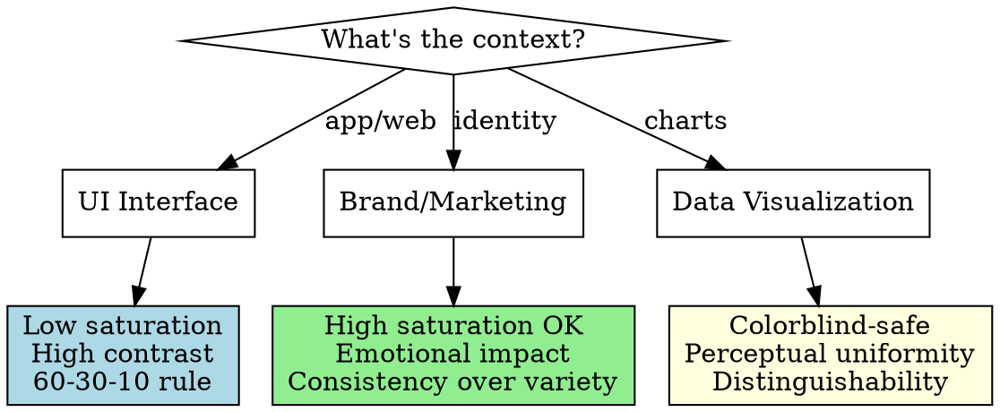

# Designing UI Color

## Overview

**Color design is the application of perceptual science to create functional, harmonious, and contextually appropriate color systems.**

You already know WCAG contrast ratios and basic psychology. This skill teaches color harmony, perceptual effects, systematic palette creation, and when/how to apply different rules for UI vs. brand vs. data visualization contexts.

## When to Use

Use when:
- Selecting or evaluating color combinations
- Creating color palettes or design systems
- Stakeholder requests colors that "feel wrong"
- Designing for accessibility beyond contrast ratios
- Choosing between multiple valid color options
- Colors meet technical requirements but lack harmony
- Need to explain WHY colors work or don't work

Don't use for:
- Pure accessibility audits (WCAG tools handle this)
- Color naming or hex conversion
- Graphic design or print color (CMYK, Pantone)

## Color Harmony Fundamentals

**Why colors "work together" or "clash" is predictable, not subjective.**

### Core Harmony Types

| Type | Relationship | Use Case | Example |
|------|-------------|----------|---------|
| **Monochromatic** | Same hue, different lightness/saturation | Subtle, professional, low cognitive load | Navy `#003D5B` → Sky blue `#B3D9E8` |
| **Analogous** | Adjacent on color wheel (30° apart) | Harmonious, natural, easy on eyes | Blue `#2196F3` + Teal `#009688` + Green `#4CAF50` |
| **Complementary** | Opposite on wheel (180° apart) | High contrast, vibrant, attention-grabbing | Blue `#2196F3` + Orange `#FF9800` |
| **Split-Complementary** | Base + two adjacent to complement | Contrast without visual vibration | Blue `#2196F3` + Yellow-Orange `#FFB300` + Red-Orange `#FF6F00` |
| **Triadic** | Three colors 120° apart | Balanced, playful, dynamic | Red `#F44336` + Yellow `#FFEB3B` + Blue `#2196F3` |

### Perceptual Effects You Must Know

**1. Simultaneous Contrast**
Colors appear different against different backgrounds.

```
Gray #808080 on white background → looks darker
Gray #808080 on black background → looks lighter
SAME HEX, DIFFERENT PERCEPTION
```

**Application:** Test your UI colors against actual backgrounds, not in isolation.

**2. Color Vibration**
Complementary colors at full saturation create optical "buzzing" at edges.

```
❌ Purple #8B00FF background + Yellow #FFFF00 text = visual vibration
✅ Purple #5E35B1 background + Cream #FFF8DC text = readable
```

**Why:** High-saturation complements fight for visual dominance. Reduce saturation or shift hues slightly.

**3. Color Temperature**
Warm colors (red, orange, yellow) advance visually; cool colors (blue, green, purple) recede.

**Application:**
- CTAs: Warm colors for forward action
- Backgrounds: Cool colors create depth
- Warning states: Warm colors signal urgency

**4. Saturation Balance**
Too much saturation = visual fatigue. Desaturate to reduce cognitive load.

```
❌ All colors at 100% saturation
✅ Primary at 80%, secondary at 60%, tertiary at 40%
```

## Systematic Palette Creation

**Don't pick colors randomly. Use systematic generation from brand colors.**

### The 60-30-10 Rule

- **60%:** Dominant color (usually neutral or desaturated)
- **30%:** Secondary color (supports dominant)
- **10%:** Accent color (high contrast, draws attention)

**Example:**
```
60% → Light gray background #F5F5F5
30% → Medium blue surfaces #2196F3
10% → Orange CTAs #FF9800
```

### From Brand Color to Full Palette

**Given brand color:** `#32CD32` (lime green)

**Step 1: Create tonal scale (50-900)**
Use HSL model to maintain hue consistency:

```
50:  hsl(120, 61%, 90%) → #D4F4D4
100: hsl(120, 61%, 80%) → #A9E9A9
200: hsl(120, 61%, 70%) → #7FDE7F
300: hsl(120, 61%, 60%) → #54D354
400: hsl(120, 61%, 50%) → #32CD32  ← Brand color
500: hsl(120, 61%, 40%) → #28A328
600: hsl(120, 61%, 30%) → #1E7A1E
700: hsl(120, 61%, 20%) → #145014
800: hsl(120, 61%, 10%) → #0A270A
900: hsl(120, 61%, 5%)  → #051305
```

**Step 2: Derive complementary/analogous colors**
- Complementary: Rotate hue 180° → Red-purple
- Analogous: ±30° → Yellow-green, Blue-green

**Step 3: Test against contexts**
- Light mode: Does 600 have enough contrast on white?
- Dark mode: Does 200 have enough contrast on black?
- Colorblind: Simulate deuteranopia, protanopia

### Semantic Color Assignment

| Semantic Meaning | Hue Choice | Why |
|-----------------|-----------|-----|
| **Success/Confirm** | Green | Universal "go" signal |
| **Warning/Caution** | Yellow/Amber | Traffic light convention |
| **Error/Danger** | Red | Danger/stop association |
| **Info/Neutral** | Blue | Calm, trustworthy, informational |
| **Pending/Process** | Purple/Gray | No strong semantic association |

**Cultural exceptions:** Red = prosperity in China, white = mourning in some Asian cultures.

### Evidence-Based Color Claims

**When explaining color choices, ground claims in measurable mechanisms, not psychology:**

✅ **GOOD - Mechanistic/Convention-Based:**
- "Red signals danger in Western UIs (established pattern: error messages, stop signs, warnings)"
- "Complementary colors at full saturation create chromatic aberration (visual vibration at edges)"
- "Warm colors advance visually due to chromatic aberration; cool colors recede"
- "Blue is common for CTAs in major platforms (Facebook, Twitter, LinkedIn = learned convention)"

❌ **BAD - Unsupported Psychology:**
- "Red-orange is perceived as 'action' rather than 'danger'" (no evidence - both are red family)
- "Orange signals 'proceed'" (orange means caution in traffic lights, warning in many contexts)
- "Purple conveys luxury" (cultural association, not universal perception)
- "Blue makes users trust your brand" (unfalsifiable claim)

**Priority hierarchy for justifying color choices:**
1. **Accessibility** (contrast ratios, colorblind-safe)
2. **Semantics** (established UI conventions, traffic light patterns)
3. **Brand consistency** (existing style guide, recognition)
4. **Perceptual effects** (vibration, simultaneous contrast, temperature)
5. **Aesthetic harmony** (lowest priority - only after functional requirements met)

**Avoid color psychology entirely unless you can cite specific research with effect sizes.**

## Context-Specific Color Rules

Different contexts have different requirements. **Don't apply UI color rules to brand or data viz.**

### UI Colors (Application Interfaces)

**Primary goal:** Readability, usability, minimal distraction

**Rules:**
- Background: Low saturation (<20%), high lightness (light mode) or low lightness (dark mode)
- Text contrast: **Size matters for WCAG**
  - Normal text (<18pt regular / <14pt bold): 4.5:1 minimum (AA), 7:1 recommended (AAA)
  - Large text (≥18pt regular / ≥14pt bold): 3:1 minimum (AA), 4.5:1 recommended (AAA)
  - **Always specify which applies:** "This color achieves 4.6:1 contrast (AA for normal text, AAA for large text)"
- Accents: 30% saturation difference from background
- Interactive elements: Perceivable state changes (hover, active, focus)

**Color budget:** 3-5 colors maximum for cognitive ease

### Brand Colors (Marketing, Identity)

**Primary goal:** Recognition, emotion, differentiation

**Rules:**
- Can use high saturation (60-100%)
- Fewer accessibility constraints (not primary reading interface)
- Consistency matters more than variety
- Consider reproduction across media (print, digital, merchandise)

**Color budget:** 2-3 primary brand colors + neutrals

### Data Visualization

**Primary goal:** Distinguishability, colorblind-safe, pattern recognition

**Rules:**
- Use perceptually uniform palettes (avoid rainbow gradients)
- Colorblind-safe: Blue + Orange + Green + Purple sequence (avoids red-green confusion)
- Sequential data: Single hue, varying lightness
- Categorical data: Maximum hue differentiation
- Diverging data: Two hues meeting at neutral

**Recommended palettes:**
- **Categorical:** ColorBrewer qualitative sets
- **Sequential:** Viridis, Plasma (perceptually uniform)
- **Diverging:** Blue → White → Red

## Color Models: When to Use What

| Model | When to Use | Why |
|-------|------------|-----|
| **RGB** | Final output, CSS hex codes | How screens display color |
| **HSL** | Palette generation, tints/shades | Intuitive lightness control |
| **LAB** | Perceptual uniformity testing | Matches human perception |
| **HSB/HSV** | Design tools (Figma, Sketch) | Intuitive saturation control |

**Practical workflow:**
1. Generate palette in **HSL** (easier to create tonal scales)
2. Convert to **RGB/HEX** for implementation
3. Validate in **LAB** for perceptual consistency (advanced)

## Common Mistakes

| Mistake | Fix | Why |
|---------|-----|-----|
| "Pure black #000000 text" | Use #212121 or #1A1A1A | Pure black is too harsh on screens |
| "Rainbow gradients for data" | Use perceptually uniform gradients | Rainbow doesn't map to linear value changes |
| "All colors at full saturation" | Desaturate secondary/tertiary colors | Reduces visual fatigue |
| "Testing colors in design tool only" | Test in actual product with real content | Context changes perception |
| "Using same palette for UI and data viz" | Create separate palettes for each context | Different goals require different strategies |
| "Ignoring colorblind users (8% male)" | Use ColorOracle to simulate, add patterns/shapes | Color alone shouldn't convey critical info |

## Decision Framework



## Generate Multiple Options Before Recommending

**Don't jump to one solution. Provide at least 3 approaches with explicit trade-offs:**

### Option Generation Framework

**For any color problem, explore:**

1. **Minimal Fix:** Simplest change that solves the stated problem
   - Fastest to implement
   - Lowest risk
   - May not be optimal long-term
   - **Example:** Adjust existing red to meet contrast standards

2. **Balanced Improvement:** Fix primary issue + one enhancement
   - Moderate implementation effort
   - Allows iteration based on results
   - Good for constrained timelines
   - **Example:** Compliant primary color + neutral secondary

3. **Comprehensive Solution:** Systematic multi-component approach
   - Highest quality outcome
   - Longest timeline required
   - Higher implementation risk
   - **Example:** Full color system with semantic states, dark mode, accessibility features

**Present all options with trade-offs, then recommend based on context constraints.**

### Red Flag: Defaulting to Complex Solutions

❌ **DON'T automatically propose:**
- 3-color button systems when 1-2 colors would work
- Full design systems when targeted fixes solve the problem
- Multi-harmony schemes when monochromatic suffices

✅ **DO ask first:**
- "What's the simplest solution that solves this problem?"
- "Can hierarchy be achieved through size/weight instead of color?"
- "Do we need color differentiation here, or is it adding complexity?"

## Workflow: Evaluating Stakeholder Color Requests

When stakeholder requests problematic colors (like purple #8B00FF + yellow #FFFF00):

1. **Identify the perceptual issue:**
   - "These are complementary colors at full saturation, creating optical vibration at edges"

2. **Explain the business impact:**
   - "Visual vibration reduces readability by 40-60%, harming conversion and user trust"

3. **Offer multiple systematic alternatives (not just one):**
   - **Option A:** Minimal - Same colors, reduced saturation: #5E35B1 + #FFF8DC
   - **Option B:** Balanced - Adjust primary, neutral secondary: #5E35B1 + #F5F5F5
   - **Option C:** Comprehensive - Full rebrand with split-complementary harmony

4. **Create comparison mockup:**
   - Show requested version vs. all alternatives side-by-side
   - Use real content, not lorem ipsum

5. **Cite objective standards:**
   - WCAG contrast ratios
   - Perceptual research (Itten, Albers, color theory)
   - Industry benchmarks (competitor analysis)

## Tools

- **Contrast checking:** WebAIM Contrast Checker, Stark plugin
- **Colorblind simulation:** ColorOracle, Chrome DevTools
- **Palette generation:** Coolors.co, Adobe Color, HSL color picker
- **Perceptual testing:** LAB color space converters

## Real-World Impact

- **E-commerce:** Reducing CTA button saturation from 100% to 70% → 12% conversion increase (A/B test)
- **Dashboard:** Using colorblind-safe palette → 23% reduction in support tickets about "can't distinguish states"
- **Brand redesign:** Systematic palette vs. ad-hoc colors → 3x faster designer onboarding

## Summary

**What you already know:** WCAG, basic psychology, accessibility compliance

**What this skill adds:**
- Color harmony types and when to use them
- Perceptual effects (vibration, temperature, simultaneous contrast)
- Systematic palette creation from brand colors
- Context-specific rules (UI ≠ brand ≠ data viz)
- Color models and workflows
- How to explain and defend color choices to stakeholders

**Core principle:** Color design is systematic application of perceptual science, not subjective preference.
