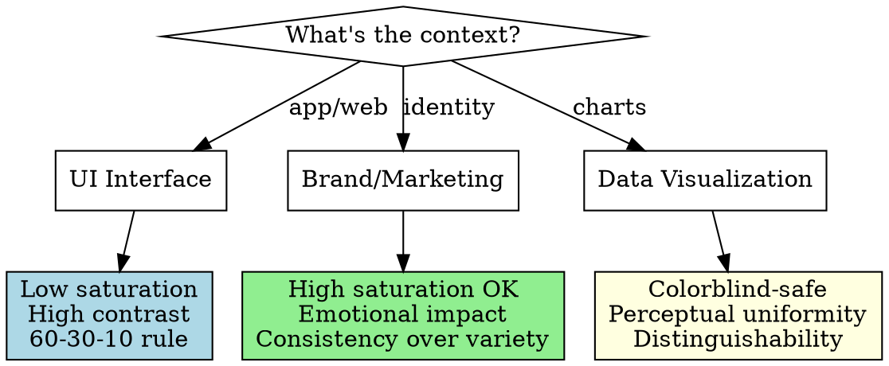

# Context-Specific Color

Rules for UI, brand, and data-visualization color contexts plus the decision framework.

## Context-Specific Color Rules

Different contexts have different requirements. **Don't apply UI color rules to brand or data viz.**

### UI Colors (Application Interfaces)

**Primary goal:** Readability, usability, minimal distraction

**Rules:**
- Background: Low saturation (<20%), high lightness (light mode) or low lightness (dark mode)
- Text contrast: **Size matters for WCAG**
  - Normal text (<18pt regular / <14pt bold): 4.5:1 minimum (AA), 7:1 recommended (AAA)
  - Large text (≥18pt regular / ≥14pt bold): 3:1 minimum (AA), 4.5:1 recommended (AAA)
  - **Always specify which applies:** "This color achieves 4.6:1 contrast (AA for normal text, AAA for large text)"
- Accents: 30% saturation difference from background
- Interactive elements: Perceivable state changes (hover, active, focus)

**Color budget:** 3-5 colors maximum for cognitive ease

### Brand Colors (Marketing, Identity)

**Primary goal:** Recognition, emotion, differentiation

**Rules:**
- Can use high saturation (60-100%)
- Fewer accessibility constraints (not primary reading interface)
- Consistency matters more than variety
- Consider reproduction across media (print, digital, merchandise)

**Color budget:** 2-3 primary brand colors + neutrals

### Data Visualization

**Primary goal:** Distinguishability, colorblind-safe, pattern recognition

**Rules:**
- Use perceptually uniform palettes (avoid rainbow gradients)
- Colorblind-safe: Blue + Orange + Green + Purple sequence (avoids red-green confusion)
- Sequential data: Single hue, varying lightness
- Categorical data: Maximum hue differentiation
- Diverging data: Two hues meeting at neutral

**Recommended palettes:**
- **Categorical:** ColorBrewer qualitative sets
- **Sequential:** Viridis, Plasma (perceptually uniform)
- **Diverging:** Blue → White → Red

## Decision Framework

