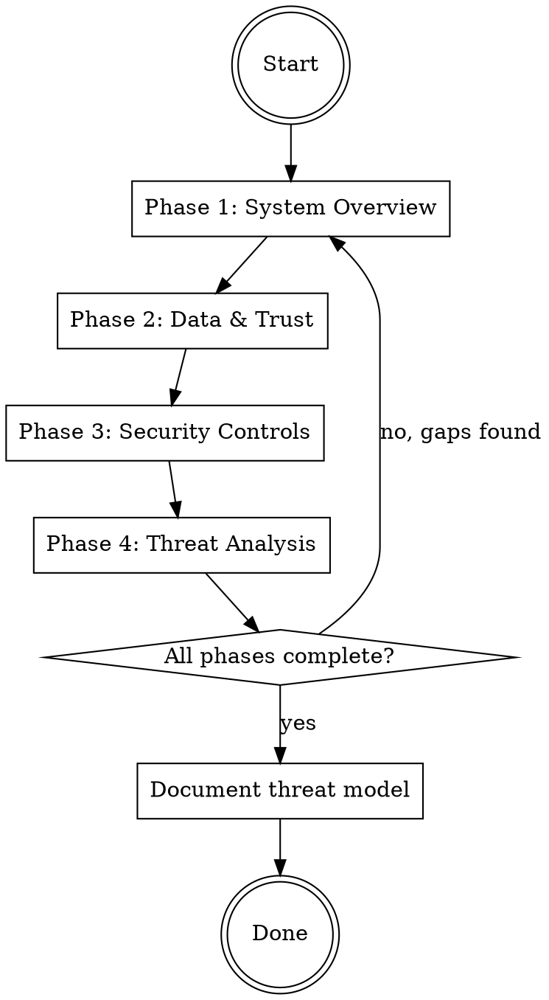

# Threat Modeling

## Overview

Create threat model documents through systematic user interview. **Interview first, document after.** Never assume - always ask.

## When to Use

- User requests a threat model for a system/service/component
- Security review or compliance requirement needs threat documentation
- New system design needs security analysis

## The Iron Law

```
NO DOCUMENTATION WITHOUT COMPLETE INTERVIEW
```

**Violations:**
- Making assumptions about system details
- Listing all questions upfront instead of interactive dialogue
- Writing threats before understanding the system
- Stopping interview because user "seems in a hurry"

## Interview Protocol



### Phase 1: System Overview

Ask ONE question at a time. Wait for response before proceeding.

**Required information:**
- [ ] What does the system do? (purpose, functionality)
- [ ] What components exist? (services, databases, APIs, UI)
- [ ] What external systems does it connect to?
- [ ] What is the deployment environment? (cloud, on-prem, hybrid)
- [ ] Who are the users/consumers?
- [ ] What are the security requirements? (confidentiality, integrity, availability)
- [ ] What trust assumptions exist? (who/what is trusted vs untrusted)
- [ ] What is in scope for this threat model? What components should we focus on?
- [ ] What is out of scope? (e.g., handled by another team, covered by existing threat model)

**Assets inventory:**
- [ ] What are the valuable assets? (data, credentials, functionality, reputation)
- [ ] What would an attacker want to steal, modify, or disrupt?

**Attack surface:**
- [ ] What are the entry points? (APIs, UI, file inputs, network interfaces)
- [ ] What's exposed to untrusted users or networks?

### Phase 2: Data & Trust Boundaries

**Required information:**
- [ ] What data enters the system? From where?
- [ ] What data leaves the system? To where?
- [ ] What data is stored? Where?
- [ ] What is the sensitivity level of each data type?
- [ ] Where are trust boundaries? (network segments, user/system, internal/external)
- [ ] What components exist within each trust boundary?
- [ ] What external systems are accessed and how? (for DFD)

### Phase 3: Security Controls

**Required information:**
- [ ] How is authentication handled?
- [ ] How is authorization handled?
- [ ] What secrets exist? How are they stored?
- [ ] What cryptography is used? (TLS, encryption at rest)
- [ ] What logging/monitoring exists?
- [ ] Any compliance requirements? (PCI, HIPAA, SOC2, GDPR)

**Third-party / supply chain:**
- [ ] What external dependencies exist? (libraries, services, tools)
- [ ] How are they obtained and validated?
- [ ] What's the trust model for third-party components?

### Phase 4: Threat Analysis (STRIDE)

For each component and data flow, probe for:

| Category | Question Pattern |
|----------|------------------|
| **Spoofing** | "What stops an attacker from impersonating X?" |
| **Tampering** | "What prevents modification of X in transit/at rest?" |
| **Repudiation** | "How do you prove X happened? Is there an audit trail?" |
| **Information Disclosure** | "What prevents unauthorized access to X?" |
| **Denial of Service** | "What happens if X is overwhelmed/unavailable?" |
| **Elevation of Privilege** | "What stops a user from gaining unauthorized access to Y?" |

## Interview Rules

1. **One question at a time** - Never ask compound questions
2. **Wait for answers** - Do not proceed until user responds
3. **Probe unclear answers** - "Can you clarify..." / "What do you mean by..."
4. **Don't assume** - If user doesn't know, note it as a gap
5. **Acknowledge time pressure but don't skip** - "I understand you're busy, but for payment systems we must cover X"

## Handling Partial Information

When user says "I don't know":
- Note it explicitly as an **Open Question** in the final document
- Ask if someone else might know
- Move to next question, but flag the gap

When user gives vague answers:
- Probe for specifics: "Can you give me an example?"
- Ask about edge cases: "What happens when X fails?"
- Don't accept "it's handled" without specifics

## Interview Completion Criteria

You may proceed to documentation when ALL of these are true:
- [ ] All Phase 1-3 checkboxes answered (or explicitly flagged as gaps)
- [ ] At least one STRIDE question asked per major component
- [ ] User confirms "I think that covers it" after you summarize what you learned
- [ ] You can explain data flow from entry to exit

**Do NOT proceed if:**
- Any core component lacks threat analysis
- Authentication/authorization mechanisms unknown
- Data sensitivity levels unclear

## Red Flags - STOP and Continue Interview

| User Says | Your Response |
|-----------|---------------|
| "That's basically it" | "Let me make sure I understand the data flows..." |
| "It's pretty simple" | "Even simple systems have threats - let me ask about X" |
| "Just document what you can" | "I need to understand Y before I can accurately document threats" |
| "I don't have time for more questions" | "These questions prevent security gaps - let's prioritize the critical ones" |
| "You already have enough" | Review checklist, identify gaps, explain why each matters |

## Document Structure

Only write after interview is complete. Follow this structure:

```markdown
# [Component/System Name] Threat Model

## Summary
[1-2 paragraph overview of what system does and how it works]

## Scope

### In Scope
[Components, services, and data flows covered by this threat model]

### Out of Scope
[Components explicitly excluded and why]
- Reference other threat models where applicable
- Note components owned by other teams

## Requirements
[List what the system must provide - confidentiality, integrity, availability, etc.]

## Assumptions
[Explicit list of trust assumptions - who is trusted, what access is assumed]

## Data Flow Diagram

```mermaid
flowchart TB
    subgraph [Trust Boundary Name]
        [Components within boundary]
    end

    [Component] -->|Data description| [Component]
```

Show:
- Trust boundaries as subgraphs
- Components within each boundary
- Data flows with labels describing what moves between components
- External systems and where they cross trust boundaries

## [Functional Area 1]

[Description of component/functionality]

**Risk**: [What could go wrong]

**Mitigation**: [How it's addressed]

**TODO**: [If mitigation incomplete - action item]

[Repeat Risk/Mitigation pairs inline with each functional area]

## [Functional Area 2]

[Continue pattern for each major component/flow]

## Data Flows

### [Flow Name]
[Source -> Processing -> Destination description]

**Risk**: [Attack vector for this flow]

**Mitigation**: [Defense]

## Trust Boundaries
[Where security decisions matter - network segments, auth boundaries]

## Data Serialization / Formats
[How data is encoded, what libraries, type safety concerns]

## Storage of Secrets
[How credentials/keys are protected, who has access]

## Use of Cryptography
[TLS configuration, encryption at rest, key management]

## Accepted Risks
[Risks explicitly not being mitigated and rationale]
- Document what's accepted and why
- Note any conditions under which this should be revisited

## Action Items
[Numbered list of TODOs identified during threat analysis]
```

**Key format rules:**
- Risk/Mitigation pairs go INLINE with component descriptions, not grouped separately
- Use **Risk**: and **Mitigation**: bold markers
- Add **TODO**: for unresolved items
- Document assumptions EARLY (after summary)
- End with numbered Action Items list

## Common Interview Gaps

If user cannot answer these, flag as **Open Questions**:

- Network architecture details
- Secret management specifics
- Logging verbosity and retention
- Incident response procedures
- Third-party security posture

## Common Mistakes

| Mistake | Fix |
|---------|-----|
| Asking "tell me about your system" (too broad) | Ask specific questions per phase checklist |
| Asking compound questions | Split into separate questions |
| Accepting "we handle that" without details | Probe: "How exactly is that implemented?" |
| Documenting before interview complete | Check completion criteria first |
| Missing STRIDE categories | Ensure at least one question per category per component |
| Generic threats not tied to system | Every threat must reference specific component/flow |
| No action items for gaps | Convert every unknown/TODO to numbered action item |

## Output Quality Checklist

Before finalizing document:
- [ ] Every component mentioned has at least one threat analyzed
- [ ] Every data flow has trust boundaries identified
- [ ] Every threat has a mitigation (or explicit TODO)
- [ ] No assumptions made without flagging in "Assumptions" section
- [ ] Open questions from interview are documented
- [ ] Action items numbered and actionable
