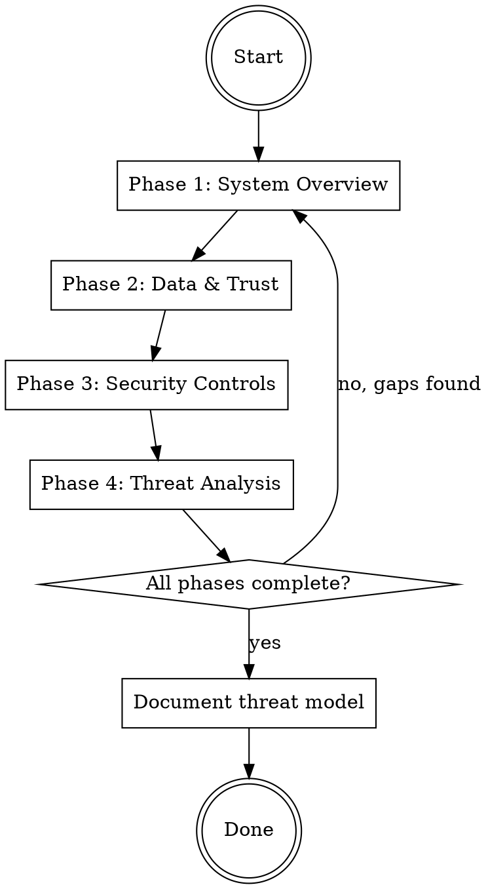

# Threat Model Interview Checklist

This reference covers detailed interview questions, gap handling, red flags, and common interview mistakes.

## Interview Flow

## Phase 1: System Overview

Ask one question at a time. Wait for response before proceeding.

**Required information:**

- [ ] What does the system do? Purpose and functionality.
- [ ] What components exist? Services, databases, APIs, UI.
- [ ] What external systems does it connect to?
- [ ] What is the deployment environment? Cloud, on-prem, hybrid.
- [ ] Who are the users or consumers?
- [ ] What are the security requirements? Confidentiality, integrity,
  availability.
- [ ] What trust assumptions exist? Who or what is trusted vs untrusted.
- [ ] What is in scope for this threat model? What components should we focus
  on?
- [ ] What is out of scope? For example, handled by another team or covered by
  an existing threat model.

**Assets inventory:**

- [ ] What are the valuable assets? Data, credentials, functionality,
  reputation.
- [ ] What would an attacker want to steal, modify, or disrupt?

**Attack surface:**

- [ ] What are the entry points? APIs, UI, file inputs, network interfaces.
- [ ] What's exposed to untrusted users or networks?

## Phase 2: Data and Trust Boundaries

**Required information:**

- [ ] What data enters the system? From where?
- [ ] What data leaves the system? To where?
- [ ] What data is stored? Where?
- [ ] What is the sensitivity level of each data type?
- [ ] Where are trust boundaries? Network segments, user/system,
  internal/external.
- [ ] What components exist within each trust boundary?
- [ ] What external systems are accessed and how? This informs the DFD.

## Phase 3: Security Controls

**Required information:**

- [ ] How is authentication handled?
- [ ] How is authorization handled?
- [ ] What secrets exist? How are they stored?
- [ ] What cryptography is used? TLS, encryption at rest.
- [ ] What logging and monitoring exists?
- [ ] Any compliance requirements? PCI, HIPAA, SOC2, GDPR.

**Third-party / supply chain:**

- [ ] What external dependencies exist? Libraries, services, tools.
- [ ] How are they obtained and validated?
- [ ] What's the trust model for third-party components?

## Handling Partial Information

When user says "I don't know":

- Note it explicitly as an **Open Question** in the final document.
- Ask if someone else might know.
- Move to next question, but flag the gap.

When user gives vague answers:

- Probe for specifics: "Can you give me an example?"
- Ask about edge cases: "What happens when X fails?"
- Do not accept "it's handled" without specifics.

## Red Flags: Stop and Continue Interview

| User says | Your response |
|---|---|
| "That's basically it" | "Let me make sure I understand the data flows..." |
| "It's pretty simple" | "Even simple systems have threats. Let me ask about X." |
| "Just document what you can" | "I need to understand Y before I can accurately document threats." |
| "I don't have time for more questions" | "These questions prevent security gaps. Let's prioritize the critical ones." |
| "You already have enough" | Review checklist, identify gaps, explain why each matters. |

Acknowledge time pressure but don't skip: "I understand you're busy, but for payment systems we must cover X".

## Common Interview Gaps

If user cannot answer these, flag them as **Open Questions**:

- Network architecture details
- Secret management specifics
- Logging verbosity and retention
- Incident response procedures
- Third-party security posture

## Common Mistakes

| Mistake | Fix |
|---|---|
| Asking "tell me about your system" | Ask specific questions per phase checklist. |
| Asking compound questions | Split into separate questions. |
| Accepting "we handle that" without details | Probe: "How exactly is that implemented?" |
| Documenting before interview complete | Check completion criteria first. |
| Missing STRIDE categories | Ensure at least one question per category per component. |
| Generic threats not tied to system | Reference specific component or flow. |
| No action items for gaps | Convert every unknown or TODO to numbered action item. |
